# Project Management Institute Certification

Provides an overview of the CAPM certificate 

## Smart homes for the elderly
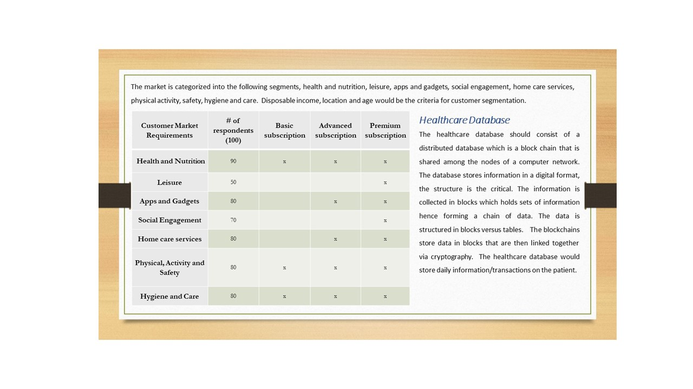

## Smart homes for the elderly
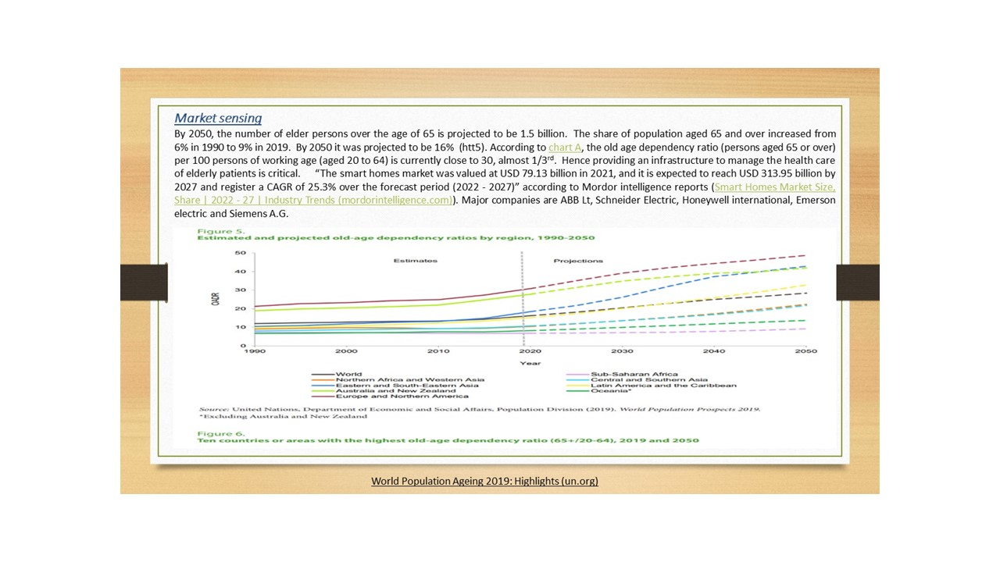

## Smart homes for the elderly
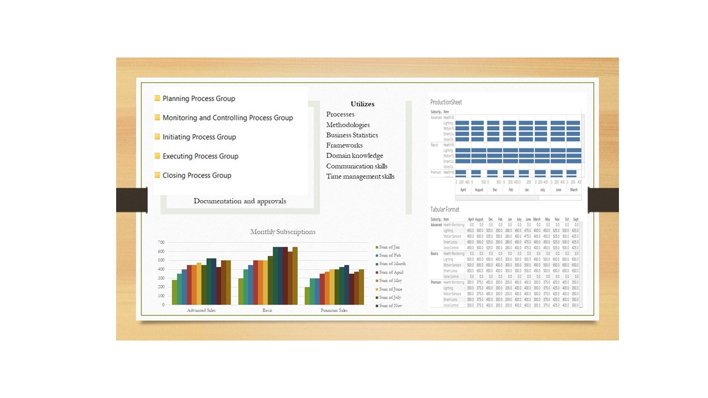

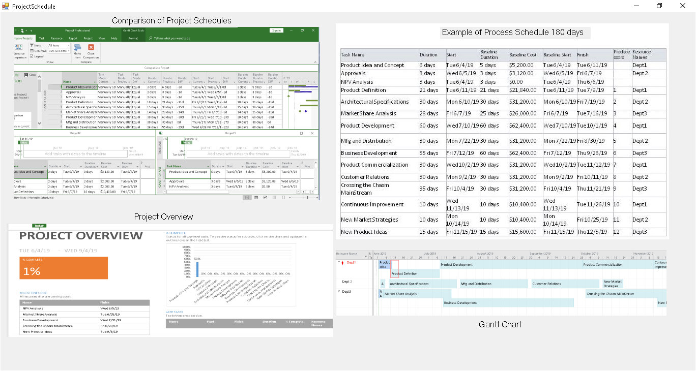

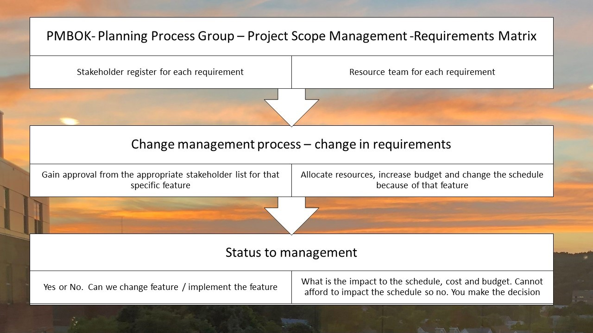

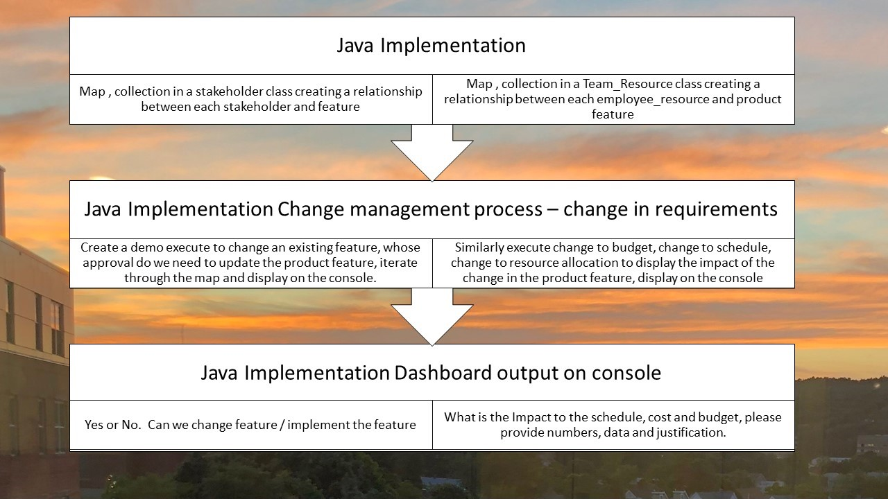

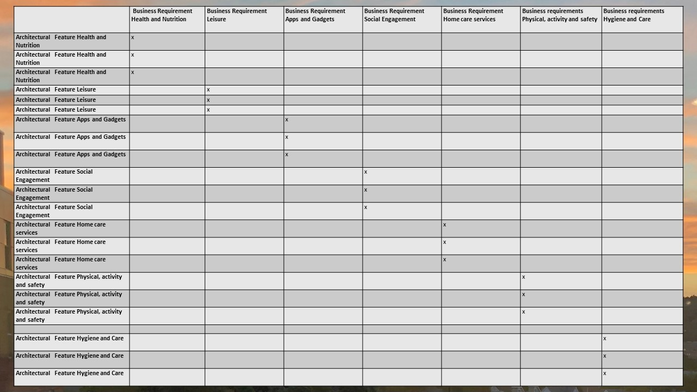

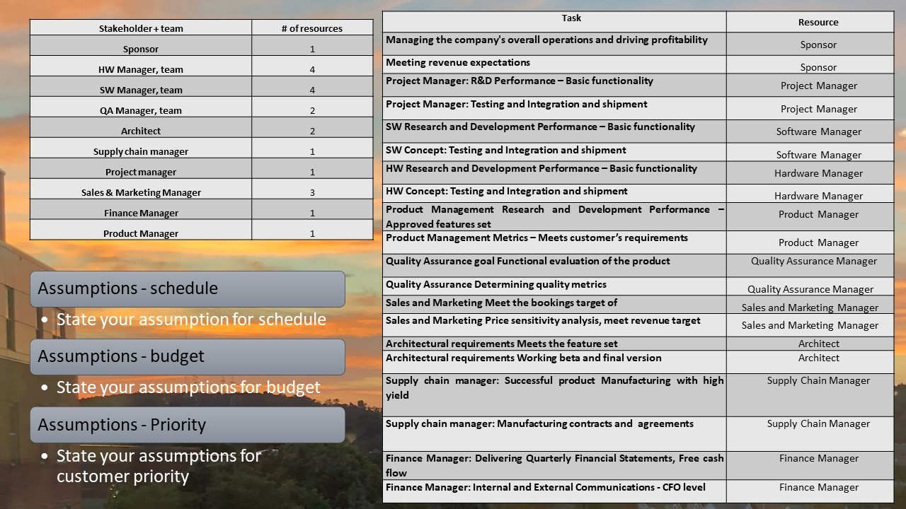

## Java project
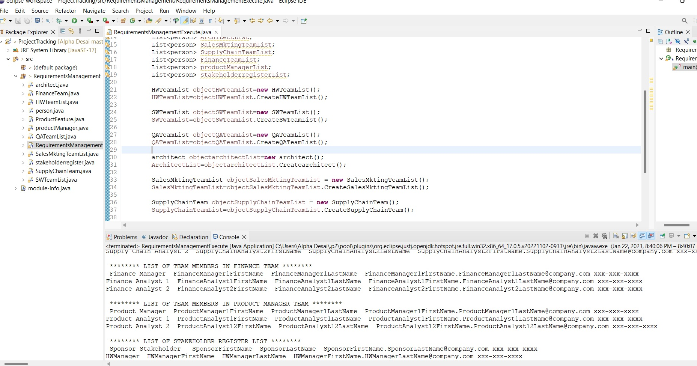

## Java project resource allocation
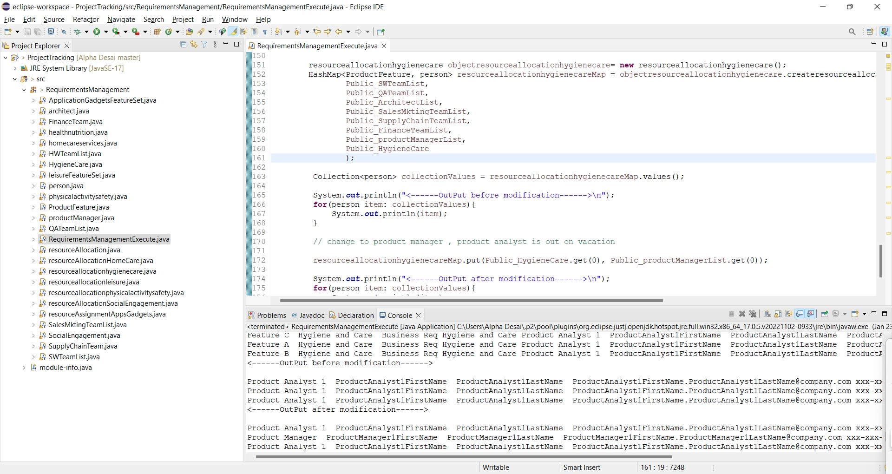

## Java project 
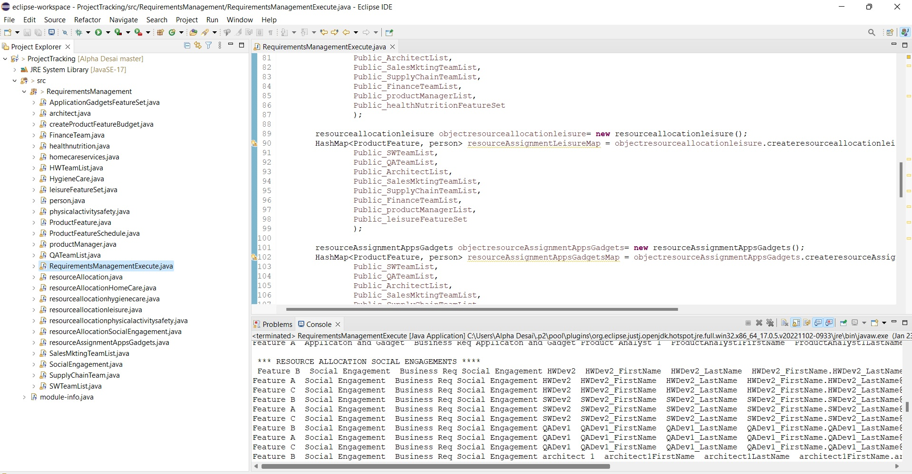

Additional details reference https://github.com/alpaddesai/GraduateDegrees
