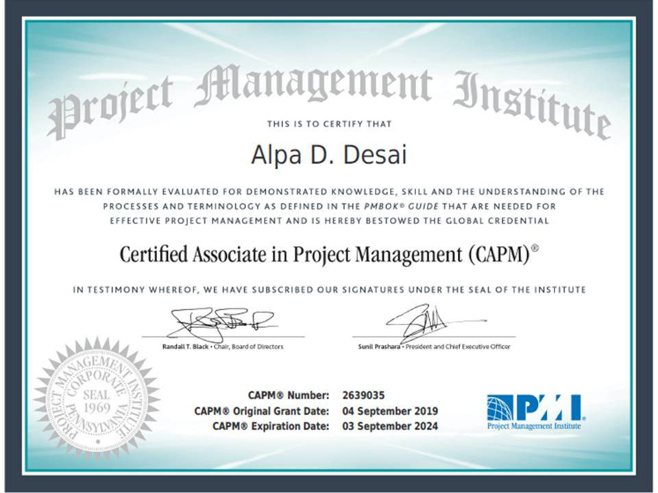

# Project Management Institute Certification

Provides an overview of the CAPM certificate 

#### Awards and Recognition
• Received “Employee Recognition Awards” at Teradyne Inc. April 2010 
• Received “Teradyne Employee Core Value Award” at Teradyne Inc. Dec 2006 
• Winner of McCallum Graduate School of Business Leadership Scholarship Award 2008–2009 
• Received “SWE Outstanding Student award 2004-2005” Society of Women Engineers

## CAPM certificate

### practice test
![image] (CAPMpracticetestI.jpg)

Additional details reference https://github.com/alpaddesai/EngineeringProjectManagement
