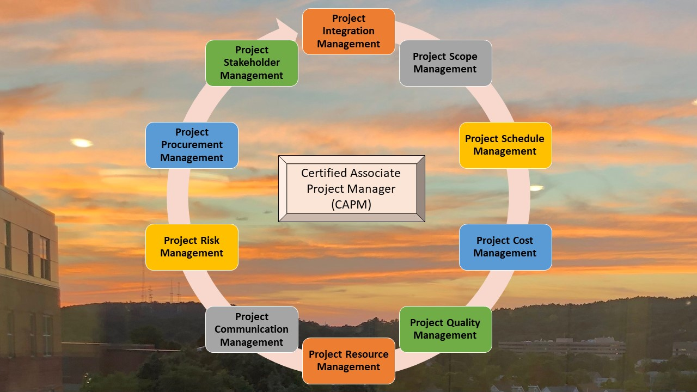

# Project Management Institute Certification

Provides an overview of the CAPM certificate 

## Smart homes for the elderly

## Smart homes for the elderly

## Smart homes for the elderly

## Java project

## Java project resource allocation

## Java project 

Additional details reference https://github.com/alpaddesai/GraduateDegrees
